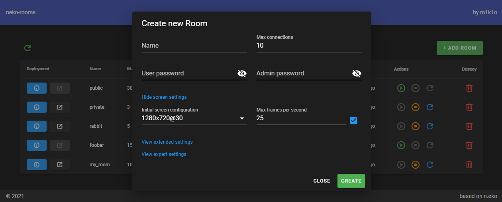

# Neko Rooms CI/CD pipeline

Deploy Neko Rooms server with CI/CD on Elestio

 
 

# Once deployed ...

You can open Neko Rooms web UI here:

    https://[CI_CD_DOMAIN]/
    Login: [ADMIN_EMAIL]
    password: [ADMIN_PASSWORD]
